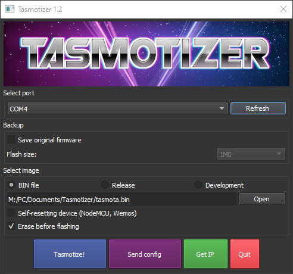

# Flash Sonoff devices with Tasmota
This a easy step-by-step guide on how to flash Sonoff devices like Sonoff S26, Sonoff Basic etc. 
In this guide we'll flash the Sonoff S26 plug. You can find more info about the flashing process for other Sonoff devices [**here**](https://templates.blakadder.com/plug.html).

## Preparation

* Let's start by downloading and installing Tasmotizer: https://github.com/tasmota/tasmotizer

* Then download *tasmota.bin* from here: https://github.com/arendst/Tasmota-firmware/tree/main/release-firmware/tasmota

* Choose your programmer of choice. I have a AVR Pocket Programmer and a small USB to ESP-01 programmer and they both work. 

## Installation

* Solder your `3.3V, GND, RT` and `TX` wires to the correct pins/points on your Sonoff device: 

    J1 - 3V3
    J2 - GND
    ETX - TX
    ERX - RX
    J10 - RX | J3 - GPIO-12 | J4 - GPIO-0 | J5 - GPIO-13
    
Now connect the corresponding wires to your programmer. This is the pinouts if you're using the USB to ESP-01 programmer:

## Bringing the Module into Flash Mode

1. Disconnect the serial programmer (turn off power).
2. Press and hold the on-board button on your sonoff device.
3. Connect the serial programmer (turn on power).
4. Release the on-board button.
5. The blue LED should NOT be blinking when in Flash mode. On the Sonoff S26, the LED is off. Now your in flash mode!
6. Now we're ready to flash it!

## Software

* Open up Tasmotizer. You should see something like `COM3, COM4` under `Select port`, that's your programmer. 
* Click `Open` and find the `tasmota.bin` file you downloaded earlier. 
* Click on Tasmotize! and the flashing process should start. If not, check your wires or retry the flash mode process again. 

* Wait for the process to finish: 

* When the process is done, unplug the power to the programmer then plug it back in to power cycle the Sonoff device.

* Let it reboot then click on  `Send config` and put in your SSID and Password. If you want, you can add your MQTT info right here too. 
When you're done, click on `Save` and the device restarts.

Aftet that, wait a few seconds, click on `Get IP` and you should see your IP of your device:

Put the IP number in your web browser and you should now have access to your Sonoff device.

Good luck!