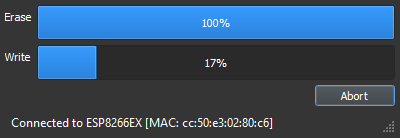
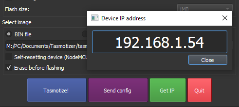
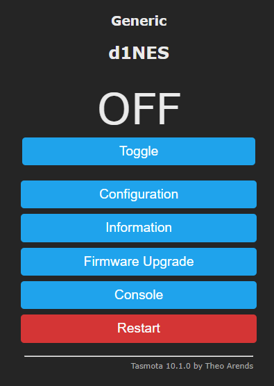
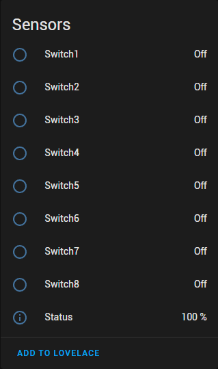

# WeMos D1 mini with multiple inputs (MQTT)
A quick guide on how to flash a WeMos D1 mini with Tasmota and configure it to have multiple inputs to create a button device to trigger home automation or similair with MQTT. 

This guide will asume you have Home Assistant installed and a MQTT broker configured.

## Installation

* Let's start by downloading and installing Tasmotizer: https://github.com/tasmota/tasmotizer

* Then download *tasmota.bin* from here: https://github.com/arendst/Tasmota-firmware/tree/main/release-firmware/tasmota

* Connect the D1 mini to your computer.

## Software

* Open up Tasmotizer. You should see something like `COM3, COM4` under `Select port`, that's your D1 mini.
* Click `Open` and find the `tasmota.bin` file you downloaded earlier. 
* Click on Tasmotize! and the flashing process should start. If not, check your wires or retry the flash mode process again. 

* Wait for the process to finish: 

* When the process is done, unplug the power to the D1 mini and plug it back in to power cycle it.

* Let it reboot then click on  `Send config` and put in your SSID and Password. If you want, you can add your MQTT info right here too. 
When you're done, click on `Save` and the device restarts.

After that, wait a few seconds, click on `Get IP` and you should see your IP of your device:

Enter the IP number in your web browser and you should now have access to your tasmota-flashed D1 mini. Go to `Configure MQTT` under `Configuration` and set up your MQTT info, if you didn't do that in Tasmotizer. 

## Configuration

* Go to `Configuration > Configure Module`
* Set device as `Generic (18)`, Hit `Save` and let it restart. Then go back to `Configure Module`
* Set all your desired GPIO pins as `Switch`, changing each to `1, 2, 3, 4` etc
* Last add a Relay with set to `1`. 

* Go to back to `Console`

1. Type in `SwitchTopic 1` This sets MQTT topic to the device %topic%.
2. Type in `SetOption19 1` for Home Assistant Discovery.
3. Set all switches so button press down = `ON` released = `OFF`. Do this for all 8 inputs:

        SwitchMode1 2
        SwitchMode2 2
        SwitchMode3 2
        SwitchMode4 2
        SwitchMode5 2
        SwitchMode6 2
        SwitchMode7 2
        SwitchMode8 2

* Go to Home Assistant, `Configuration > Devices and Services`
* Click `Devices` tab at the top
* You should see the name of your D1 mini, click on it!
* Now you can see and test all your inputs and then do some automation using Node-RED for example:

Happy automating! 