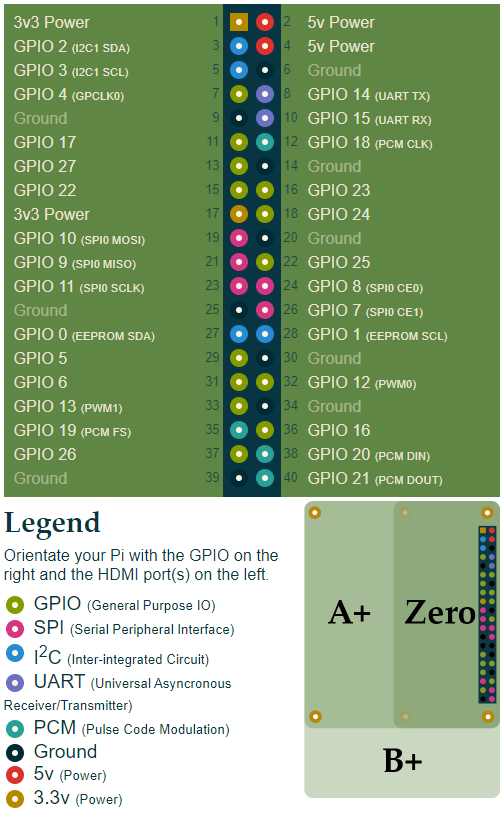
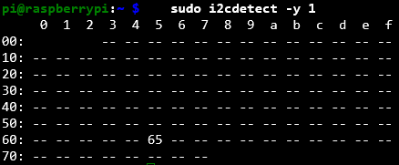
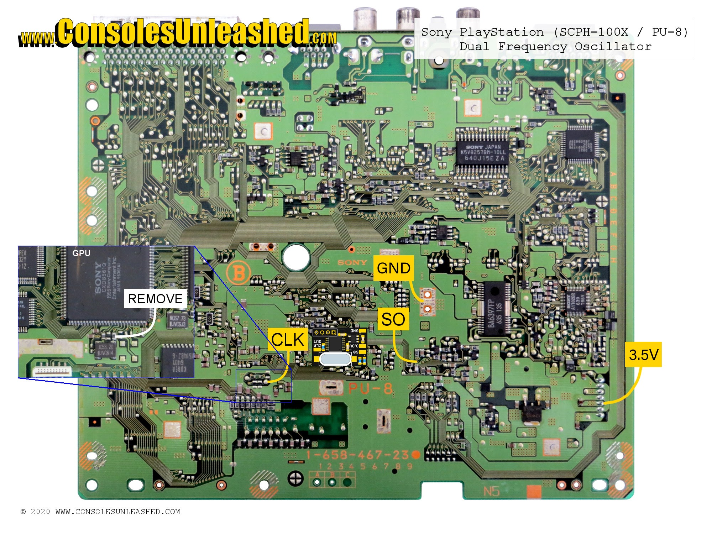
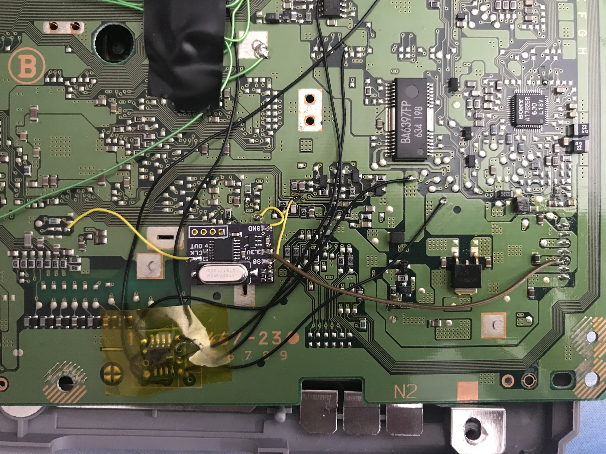

# DFO - Dual Frequency Oscillator
The DFO (Dual Frequency Oscillator), corrects the 60Hz sync frequency on region modded PAL consoles. It will NOT change the video encoding for colour over composite and RF video. They are ideal for RGB users.

This guide is for programming the Texas Instruments CDCE913/925 PLL chip used with DFO's using a Raspberry Pi. This is a collection of files to make the process much easier. 

Original German thread [here](https://circuit-board.de/forum/index.php/Thread/18016-DFO-Dual-Frequency-Oscillator/). English thread [here](https://nfggames.com/forum2/index.php?topic=5744.0) (outdated).

Credit goes to [ikorb](https://github.com/ikorb/cdceprog).

## DFO PCB's

There are three types of DFO's. Each one are suited for different consoles:

* DFO 5V DIL14 - Mega Drive
* DFO 5V SMD - Playstation
* DFO 3.3V SMD - SNES (?)

If you don't already have a PCB or can't manage to buy one, you can order them from [JLCPCB](https://jlcpcb.com/) or [PCBWay](https://pcbway.com/) by uploading the gerber files located [here](gerbers/).

## Configuration

Before you start programming, you should have a Raspberry Pi running Raspbian or similar. Either connected through SSH (recommended) or typing directly on the RPi, we need to make sure `ARM I2C interface` is enabled, by typing:

       sudo raspi-config

Navigate to `Interface Options > I2C > Yes` to enable `ARM I2C interface`.

Now check if it's working:
       
       sudo i2cdetect -y 1

You should see something like this:

Great! Now you're all set for the next step.

## Connections

To connect the DFO to the Raspberry Pi, the programming pins on the DFO must be connected as follows:

* DFO `SCL` to RasPi pin 5
* DFO `SDA` to RasPi pin 3
* DFO `GND` to RasPi pin 6
* DFO `3.3V` or `5V` to RasPi pin 1 or 2 (depends on the DFO board)

 

When the connection is done, check if you can communicate again with the clock generator chip on the DFO using:

       sudo i2cdetect -y 1

You should see a lot of dashes (like the previous picture) but in all those dashes there should be a number saying 65 (or any number) like this:

.

If so, your good to go. If not, check your connections.

## Programming

Let's start by downloading the Python script (this does the programming) and the HEX-files for Mega Drive/Playstation or Saturn.

Type the following:

       cd Downloads
       git clone https://github.com/fix-ON/cdceprog_DFO.git
       cd cdceprog_DFO
       
Now, if your programming a DFO for the Mega Drive or Playstation, use `MD_PSX.HEX`. The Saturn, use `SAT.HEX`.

In this guide we're using the `MD_PSX.HEX`, so type:

       sudo python cdceprog.py MD_PSX.HEX 
       
You should see a text that says: 

       Found data for a CDCE 913 chip.
       Waiting until EEPROM write cycle finishes...
       
Congratulations!

Your DFO is now programmed.

## Installation

Connect the DFO pins to the corresponding points on your specific motherboard version.

- [Installation guide for Playstation](https://www.consolesunleashed.com/guides/sony-playstation-dual-frequency-oscillator-install-guide/)
- [Installation guide for Mega Drive](https://www.consolesunleashed.com/guides/sony-playstation-dual-frequency-oscillator-install-guide/)

Playstation SCPH-100X PU-8:
  

Example of installed DFO in a Playstation.

