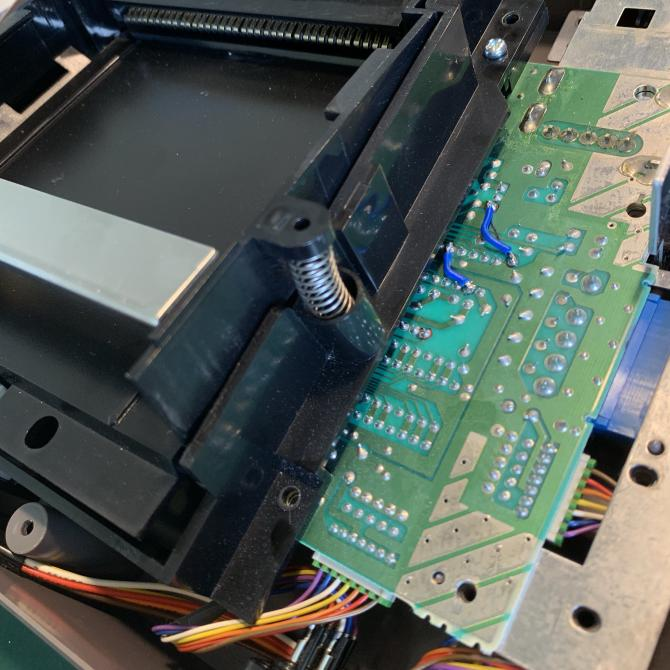
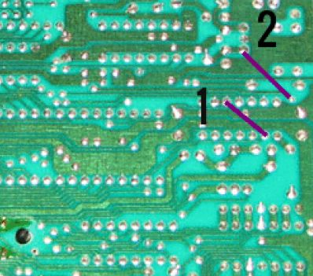
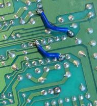

# Region Free NES

Simple mod to make your NES play games from any region.
> This will not alter the speed at which your console run the games.

## Items needed
- Phillips screwdriver
- Soldering Iron
- Solder
- Wire

## Instructions
[In depth disassembly guide](https://www.ifixit.com/Guide/Nintendo+Entertainment+System+Disassembly/143046) is available at ifixit.

1. Remove the screws on the bottom of your NES, and lift the bottom half away from the top housing.
2. Remove the screws holding the RF shield (The big metal plate), and remove the RF shield.
3. *(Optional)* Remove the screws from the cartridge tray. Once free, slide the cartridge tray towards you and then lift slightly in the front to remove.
4. Solder the two wires as seen in the images below.

