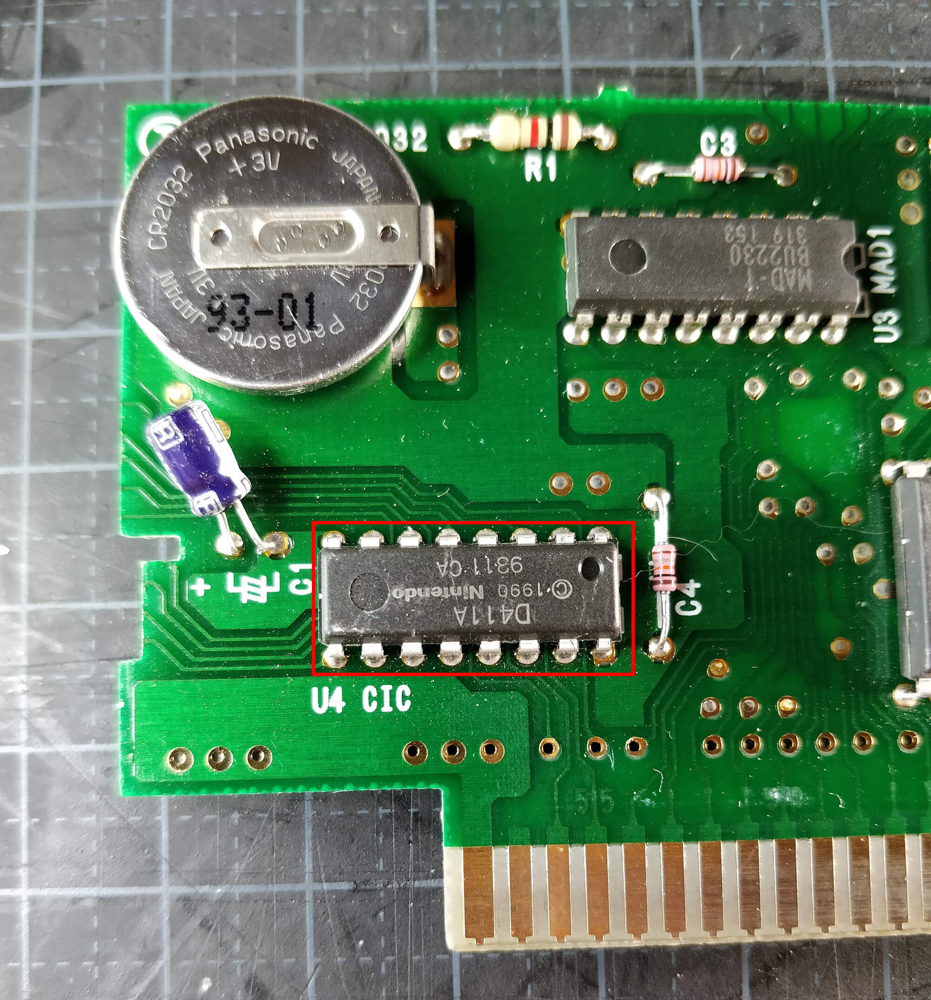
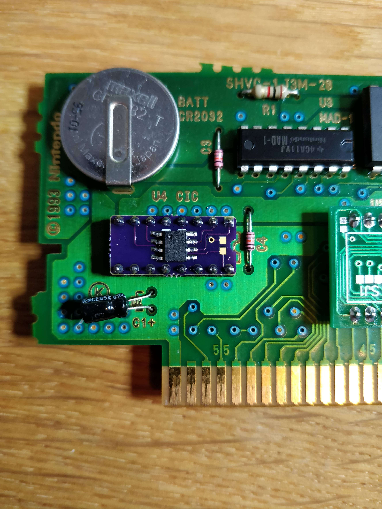

# Region Free SNES Cart

Make your SNES cart region free with a SuperCIC key.

## Items needed
- 3.8mm gamebit
- Soldering iron
- Something for desoldering (Solder wick, Heat gun, Pump etc.)
- SuperCIC key

## Instructions
1. Open the cart and locate the CIC chip on the PCB, it says CIC on the PCB next to the chip.

2. Desolder and CIC chip and remove it.
3. Solder your SuperCIC key in place where the original CIC was located.

