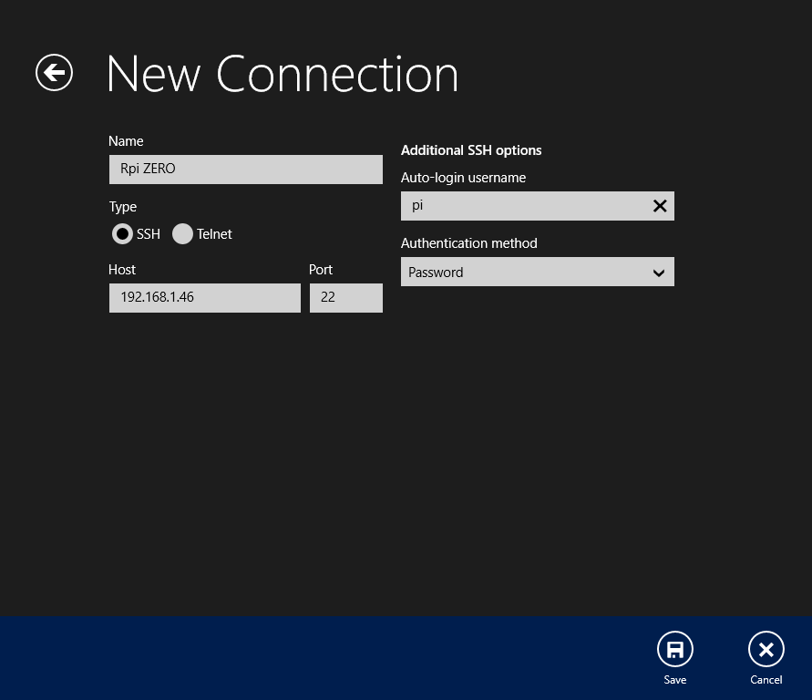

# Enable WiFi and SSH on Raspberry Pi
Raspberry Pi's with built in WiFi can be used in a lot of ways without having to hook up a monitor, mouse, keyboard etc. This guide will show you how to enable WiFi and SSH, to be able to communicate with your Rpi without any hardware connected.  

## Configuration

* Take out the Rpi's SD-card and connect it to your computer.

* Download [this file](ssh_wifi.zip) and unzip it. You should see two files called:
        
        wpa_supplicant.conf
        ssh

* Open up the `wpa_supplicant.conf` in a text editor.
This file is pretty self explanatory, so in the end, it should look something like this (as an example):

        country=SE
        ctrl_interface=DIR=/var/run/wpa_supplicant GROUP=netdev
        update_config=1
        network={
        ssid="Billys_WIFI"
        psk="where_is_the_dump"
        key_mgmt=WPA-PSK
        }
* Only change the `ssid` and `psk` to match your WiFi settings. 

* Now save it and copy `wpa_supplicant.conf` and `ssh` to the root of your SD-card. 

* Unmount the SD-card, put it back into the Rpi, power it up and after a few minutes, you should be able to connect to your Pi using SSH.

## Finding the IP-address

The Rpi is now connected to your network so we need to figure out what the local IP-address is, to be able to connect to it. 

Advanced IP Scanner [(Windows)](https://www.advanced-ip-scanner.com/) is a good choice to scan your network and see each IP-address of all your computers/devices. 
You could also use Fing for [iOS](https://apps.apple.com/us/app/fing-network-scanner/id430921107) or [Android](https://play.google.com/store/apps/details?id=com.overlook.android.fing&hl=en&gl=US) on your smartphone, to do the same thing. 

Once you've found your Rpi's IP-address, write it down and continue with the next step.

## Software

To connect with SSH you need a terminal. If you're using Windows, try [Remote Terminal](https://www.microsoft.com/en-us/p/remote-terminal/9wzdncrdn8b3?activetab=pivot:overviewtab) from the Windows Store. You can also try [Putty](https://www.putty.org/).

If you're using Mac or Linux, search for Terminal on your computer, since it's built in.

This guide is for using Remote Terminal on Windows but the process should be the same.

## Connecting

* Open up the Remote Terminal app and click on `Add` at the bottom right.

* Add a name, IP-address and a username, like so:

Click Save.

* Now choose your Rpi and click `Connect`. 

* A terminal window should pop up asking for password, put in `raspberry` (default password). If everything went well, you're now connected to your Rpi through SSH!
